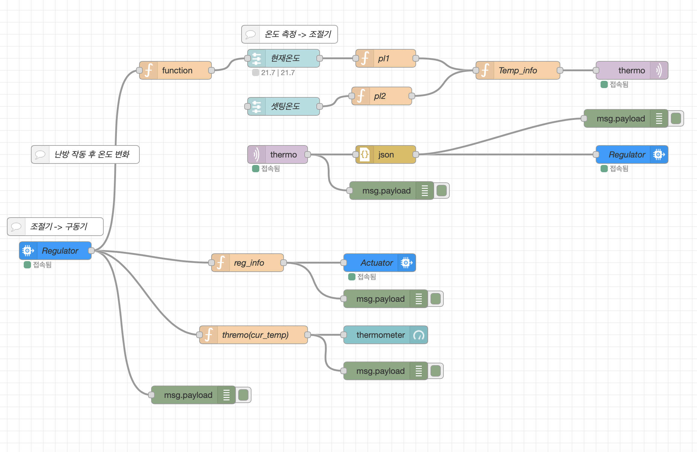
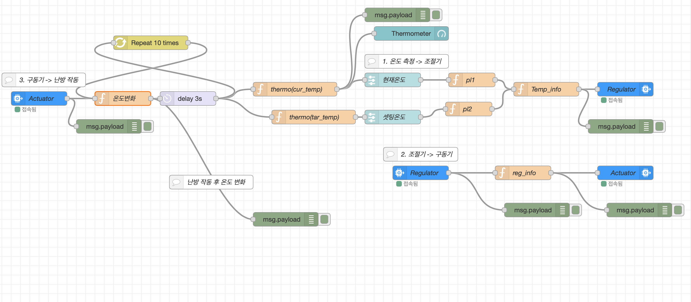

# IBM IOT를 이용한 난방 조절 시스템
### 시스템 시나리오
1. 시스템 첫 시작 시, 현재 온도와 설정 온도를 입력받는다. 
2. 현재 온도가 설정 온도보다 낮을 시, 난방 시스템 가동
   > 난방 시스템은 3초에 0.5도 씩 현재 온도를 높인다.
3. 현재 온도가 설정 온도보다 높을 시, 난방 시스템 작동 중단
   > 난방 시스템이 작동되지 않는 동안, 10초에 0.1도 씩 현재 온도가 낮아진다.

### Node-RED Flow
#### sys_flow

- Heating system with python & mqtt

#### heating sys flow

- Heating sytstem with Ibm cloud

- iotActuator.py: Sub iotReg.py or iotRegulator.py
- iotActuatorTest.py: Sub iotRegulatorTest.py
- iotReg.py: NODE-RED Dashboard를 사용하여 슬라이더(온도계) 2개로 현재 온도와 설정 온도를 입력 받아 작동 제어
- iotRegulator.py: 현재 온도와 설정 온도를 입력 받아 작동 제어
- iotRegulatorTest.py: 현재 온도(cmd)와 설정 온도를 입력 받아 작동 제어
- sys_flow.json: Node-RED flow 파일
- heating_sys_flow.json: Node-RED flow 파일2. 대쉬보드만을 이용하여 난방 조절
